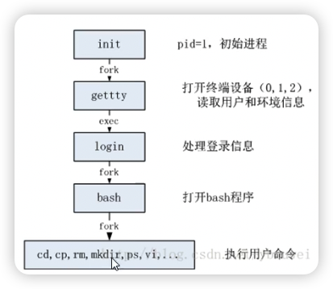
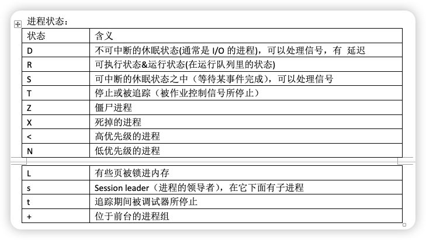
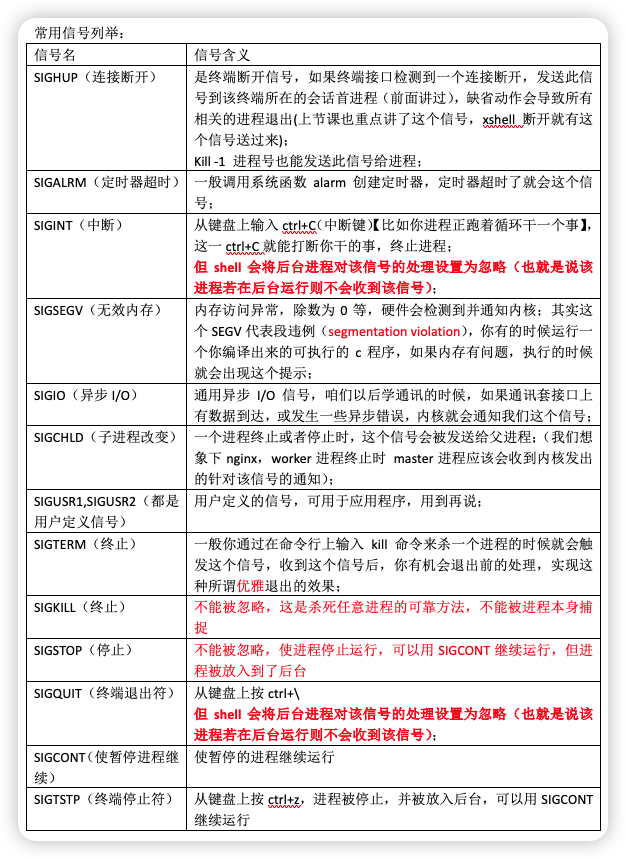

## ps

ps -ef | grep xxx

- `-e`表示，显示所有进程
- `-f`表示，显示详细信息
- `-l`表示，长显示
- `-a`表示，显示所有终端的信息

pts/0 pts/1，表示虚拟终端。
每链接一个虚拟终端，就会出现一个 shell 进程，
用于解释用户输入的命令

随着终端的关闭，这个终端上运行的进程 hello 也退出了



每个进程属于一个进程组：一个或多个进程的集合。
每个进程组都有一个唯一的进程组 id。

会话(session)：一个或者多个进程组的集合。

如果一个 bash 上有多个进程，
那么这多个进程都能接受 bash 发来的信号。

一般，只要不进行特殊的系统调用，一个 bash 上运行的所有程序都属于一个会话。
而这个会话有一个 session leader。那么这个 bash 通常就是 session leader。
不通常的 --> 可以调用系统函数再创建 session。

```sh
# grep 后的 | 表示 “或”
ps -eo pid,ppid,sid,tty,pgrp,comm | grep -E bash | PID | nginx
```

`-o`表示：自定义列。sid(session id); pgrp 进程组;

```sh
┌──(parallels㉿kali-linux-2022-2)-[/media/…/DOCs/cpp/cpplinux/nginx-1.22.1]
└─$ ps -eo pid,ppid,sid,tty,pgrp,comm | grep -E zsh
    pid     ppid    sid tty         pgrp comm
 154600  154597  154600 pts/0     154600 zsh
 191374  191373  191374 ?         191374 zsh
 191491  154828  191491 pts/4     191491 zsh  <-- 我们可以看到这个比较特殊，因为pid == pgrp == sid 估计这个就是 session leader
 192815  192795  191491 pts/4     192815 zsh
```

如果我 xshell 终端要断开的话，系统就会发送 sighup（终端断开） 信号给 session leader，也就是上面这个 zsh

bash 进程 受到 sighub 信号后，bash 会把信号发送给 session 的所有进程。
受到 sighub 信号后的缺省动作就是退出

strace 工具的使用，
是 linux 下调试分析诊断工具，
可以跟中程序执行时进程的系统调用以及收到的信号

```sh
sudo strace -e trace=signal -p 1359(pid)
```

然后就附着上去了

```sh
┌──(parallels㉿kali-linux-2022-2)-[/media/…/Home/DOCs/cpp/cpplinux]
└─$ sudo strace -e trace=signal -p 191491
strace: Process 191491 attached
```

然后我关闭 zsh

```sh
└─$ sudo strace -e trace=signal -p 191491
strace: Process 191491 attached
rt_sigsuspend([INT], 8
)                 = ? ERESTARTNOHAND (To be restarted if no handler)
--- SIGHUP {si_signo=SIGHUP, si_code=SI_USER, si_pid=154828（ppid）, si_uid=1000} ---
rt_sigprocmask(SIG_BLOCK, ~[RTMIN RT_1], [HUP INT], 8) = 0
rt_sigprocmask(SIG_SETMASK, [HUP INT], ~[KILL STOP RTMIN RT_1], 8) = 0
kill(-192795, SIGHUP)                   = 0
--- SIGCHLD {si_signo=SIGCHLD, si_code=CLD_KILLED, si_pid=192795, si_uid=1000, si_status=SIGHUP, si_utime=32 /* 0.32 s */, si_stime=4 /* 0.04 s */} ---
rt_sigprocmask(SIG_BLOCK, ~[RTMIN RT_1], [HUP INT CHLD], 8) = 0
rt_sigprocmask(SIG_SETMASK, [HUP INT CHLD], ~[KILL STOP RTMIN RT_1], 8) = 0
kill(-192815, 0)                        = 0
# 给进程组发送信号，这个正好上面的一个进程组的相反数
rt_sigreturn({mask=[HUP INT]})          = 0
+++ exited with 1 +++
```

综合来讲，bash 先发送 sighup 给 同一个 session 里面的所有进程，
再给自己发了 sighup 信号

bash 关闭时，如何让进程不退出？ 设想：

1. 我 hello 进程，拦截这个 sighup 信号（我不想被 kill）

我可以手动处理信号，然后忽略掉 sighup 信号。
如果我关掉 bash，那么 hello 就成为孤儿进程。
这个时候，hello 的 tty 变成了?，并且父进程变成了 1，
进程 1 是 init

```c
// sig_ign表示：我要求忽略这个信号
signal(SIGHUP, SIG_IGN);
```

2. 我 hello 进程，和 bash 进程如果不再同一个 session 里呢？

```c
setsid() // 创建新的 sid，但是进程组组长调用setsid是无效的
// 进程组组长就是：pid == pgrp
```

我们可以将：子进程有不同的 session id，并且输出

```c
#include <stdio.h>
#include <unistd.h>

int main(int argc, const char* argv[])
{
    printf("hello");

    // 信号处理程序
    // sig_ign表示：我要求忽略这个信号
    // 请操作系统不要用缺省的处理方式来对待我
    // signal(SIGHUP, SIG_IGN);

    pid_t pid = fork();
    if (pid < 0) {
        printf("fork()进程出错!\n");
    } else if (pid == 0) {
        // 子进程
        printf("子进程开始执行\n");
        setsid();
        for (;;) {
            sleep(1);
            printf("子进程休息1s");
        }
    } else {
        // 父进程，得到子进程的pid
        printf("子进程开始执行\n");
        setsid();
        for (;;) {
            sleep(1);
            printf("父进程休息1s");
        }
    }
    printf("goodbye");
    return 0;
}
```

3. 我们通过 bash 中使用 setsid

```c
setsid ./hello.out
```

就是我们通过这种方式启动的程序，他的 ppid 是 1，并且他不属于任何终端（tty=?）

4. 还有 nohup 命令

他会把 stdout 输出，重新定位到 nohup.out 中

后台执行，也就是最后加上`&` --> `./hello &`。
后台执行的时候，终端可以干其他事，但是输出还是 stdout。
再次输入命令`fd`，将后台命令切换到前台。

hello 是否会随着 bash 的关闭而关闭，与前、后台运行没有关系

## 信号

上面有提到一个新型号`SIGHUP`

信号：通知，用来通知某个进程发生了一件事情。
信号都是突发时间，信号是异步发生的（因为是突然的），信号也被称为 “软件中断”

信号如何产生：

1. 某个进程发送给另外一个进程，或者发送给自己

甚至是：如果是热更新，那么就是新的 master 进程发送给老的 master 进程
（nginx 的 master 进程）

2. 由内核（可以暂时将内核理解为操作系统）发送给某个进程

- 通过键盘输入命令 ctrl + c（中断信号），kill 命令
- 内存访问异常，除数为 0，硬件都会检测到并且通知内核

信号名字，都是以 sig 开头，上面提到了 sighup。
unix 以及类 unix 操作系统：支持的信号数量各不相同：10~60 多个之间

信号的名字实际上是：宏变量，其实也就是一些 正整数。
被定义在了`#include <signal.h>`中

linux 中的查找命令：

```sh
find / -name "signal.h" | xargs grep -in "SIGHUP"
# 从 / 路径开始
# grep -i(忽略大小写) -n(显示行号)
# xargs 用于给其他命令传递参数
```

通过 kill 命令，认识一些信号。
kill，实际上只是：给进程发送信号。
如果程序中没有对信号处理的方式，
并且我们也没有在 kill 中指定信号，
那么默认就是 “杀死进程”

如果单纯的用 kill 进程 id，那么就是往进程发送 sigterm 信号（终止信号）。

`kill -sig pid`就能发出这个 sig 对应的信号，
`kill -1 pid`，发送 sighup 信号。
`kill -2 pid`，发送 sigint 信号。
`kill -9 pid`信号非常 nb，无论程序中怎么处理都没用
`kill -19 pid`，停止，可用 sigcont 继续，但任务被放到了后台
`kill -18 pid`，使 停止的进程继续
`kill -20 pid`，sigtstp 终端 停止符，停止不是终止，这个也就是`ctrl + z`。

查看进程状态

```sh
┌──(parallels㉿kali-linux-2022-2)-[/media/…/Home/DOCs/cpp/cpplinux]
└─$ ps -eo pid,ppid,sid,tty,pgrp,stat（显示进程状态）,comm | grep -E zsh
  96295   96292   96295 pts/0      96295 Ss+  zsh
  97014       1   97014 ?          97014 Ss   zsh
  97105   97104   97105 ?          97105 Ss   zsh
  97256   97255   97256 ?          97256 Ss   zsh
  97589   87056   97589 pts/1      97589 Ss   zsh
```

还可以通过

```sh
┌──(parallels㉿kali-linux-2022-2)-[/media/…/Home/DOCs/cpp/cpplinux]
└─$ ps aux | grep -E zsh
paralle+   96295  0.1  0.2  10340  5760 pts/0    Ss+  21:06   0:00 /usr/bin/zsh
paralle+   97014  0.0  0.1   7176  3148 ?        Ss   21:07   0:00 -zsh
paralle+   97105  0.0  0.1   7176  3156 ?        Ss   21:07   0:00 -zsh
paralle+   97256  0.0  0.1   7176  3152 ?        Ss   21:07   0:00 -zsh
paralle+   97589  1.5  0.2  10356  5804 pts/1    Ss   21:09   0:01 /usr/bin/zsh -i
paralle+   98130  0.0  0.0   6096  1900 pts/1    S+   21:10   0:00 grep --color=auto -E zsh
```

状态的解释：



常见的信号



信号处理的相关动作：

当某个信号出现时，我们可以按照 3 种方式之一进行处理，我们称之为信号的处理或者与信号相关的动作：

1. 执行系统默认动作，绝大多数信号的默认动作都是：杀死这个进程（少部分是停止）
2. 忽略信号，但是`kill -9`和`kill -19`是一定会执行缺省动作的（不能忽略）
3. 捕捉该信号：写一个处理函数，当信号来的时候，使用处理函数来处理

## 信号编程初步

### unix 操作系统体系结构

会分为两个状态：用户态，内核态
