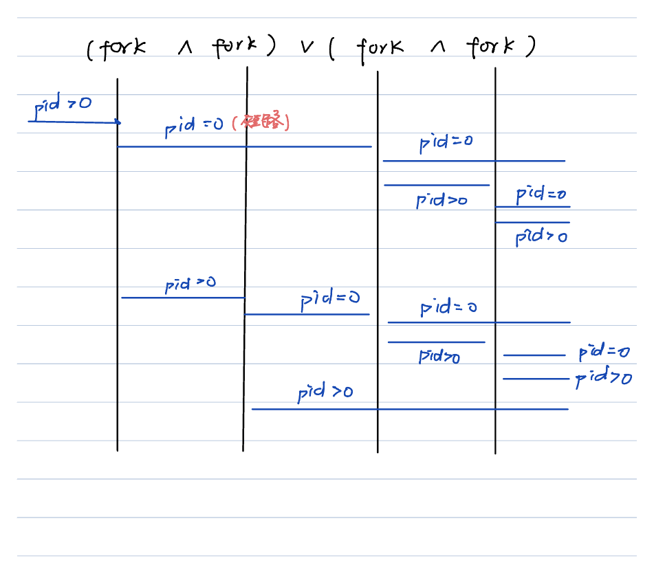

## ps

ps -ef | grep xxx

- `-e`表示，显示所有进程
- `-f`表示，显示详细信息
- `-l`表示，长显示
- `-a`表示，显示所有终端的信息

pts/0 pts/1，表示虚拟终端。
每链接一个虚拟终端，就会出现一个 shell 进程，
用于解释用户输入的命令

随着终端的关闭，这个终端上运行的进程 hello 也退出了


每个进程属于一个进程组：一个或多个进程的集合。
每个进程组都有一个唯一的进程组 id。

会话(session)：一个或者多个进程组的集合。

如果一个 bash 上有多个进程，
那么这多个进程都能接受 bash 发来的信号。

一般，只要不进行特殊的系统调用，一个 bash 上运行的所有程序都属于一个会话。
而这个会话有一个 session leader。那么这个 bash 通常就是 session leader。
不通常的 --> 可以调用系统函数再创建 session。

```sh
# grep 后的 | 表示 “或”
ps -eo pid,ppid,sid,tty,pgrp,comm | grep -E bash | PID | nginx
```

`-o`表示：自定义列。sid(session id); pgrp 进程组;

```sh
┌──(parallels㉿kali-linux-2022-2)-[/media/…/DOCs/cpp/cpplinux/nginx-1.22.1]
└─$ ps -eo pid,ppid,sid,tty,pgrp,comm | grep -E zsh
    pid     ppid    sid tty         pgrp comm
 154600  154597  154600 pts/0     154600 zsh
 191374  191373  191374 ?         191374 zsh
 191491  154828  191491 pts/4     191491 zsh  <-- 我们可以看到这个比较特殊，因为pid == pgrp == sid 估计这个就是 session leader
 192815  192795  191491 pts/4     192815 zsh
```

如果我 xshell 终端要断开的话，系统就会发送 sighup（终端断开） 信号给 session leader，也就是上面这个 zsh

bash 进程 受到 sighub 信号后，bash 会把信号发送给 session 的所有进程。
受到 sighub 信号后的缺省动作就是退出

strace 工具的使用，
是 linux 下调试分析诊断工具，
可以跟中程序执行时进程的系统调用以及收到的信号

```sh
sudo strace -e trace=signal -p 1359(pid)
```

然后就附着上去了

```sh
┌──(parallels㉿kali-linux-2022-2)-[/media/…/Home/DOCs/cpp/cpplinux]
└─$ sudo strace -e trace=signal -p 191491
strace: Process 191491 attached
```

然后我关闭 zsh

```sh
└─$ sudo strace -e trace=signal -p 191491
strace: Process 191491 attached
rt_sigsuspend([INT], 8
)                 = ? ERESTARTNOHAND (To be restarted if no handler)
--- SIGHUP {si_signo=SIGHUP, si_code=SI_USER, si_pid=154828（ppid）, si_uid=1000} ---
rt_sigprocmask(SIG_BLOCK, ~[RTMIN RT_1], [HUP INT], 8) = 0
rt_sigprocmask(SIG_SETMASK, [HUP INT], ~[KILL STOP RTMIN RT_1], 8) = 0
kill(-192795, SIGHUP)                   = 0
--- SIGCHLD {si_signo=SIGCHLD, si_code=CLD_KILLED, si_pid=192795, si_uid=1000, si_status=SIGHUP, si_utime=32 /* 0.32 s */, si_stime=4 /* 0.04 s */} ---
rt_sigprocmask(SIG_BLOCK, ~[RTMIN RT_1], [HUP INT CHLD], 8) = 0
rt_sigprocmask(SIG_SETMASK, [HUP INT CHLD], ~[KILL STOP RTMIN RT_1], 8) = 0
kill(-192815, 0)                        = 0
# 给进程组发送信号，这个正好上面的一个进程组的相反数
rt_sigreturn({mask=[HUP INT]})          = 0
+++ exited with 1 +++
```

综合来讲，bash 先发送 sighup 给 同一个 session 里面的所有进程，
再给自己发了 sighup 信号

bash 关闭时，如何让进程不退出？ 设想：

1. 我 hello 进程，拦截这个 sighup 信号（我不想被 kill）

我可以手动处理信号，然后忽略掉 sighup 信号。
如果我关掉 bash，那么 hello 就成为孤儿进程。
这个时候，hello 的 tty 变成了?，并且父进程变成了 1，
进程 1 是 init

```c
// sig_ign表示：我要求忽略这个信号
signal(SIGHUP, SIG_IGN);
```

2. 我 hello 进程，和 bash 进程如果不再同一个 session 里呢？

```c
setsid() // 创建新的 sid，但是进程组组长调用setsid是无效的
// 进程组组长就是：pid == pgrp
```

我们可以将：子进程有不同的 session id，并且输出

```c
#include <stdio.h>
#include <unistd.h>

int main(int argc, const char* argv[])
{
    printf("hello");

    // 信号处理程序
    // sig_ign表示：我要求忽略这个信号
    // 请操作系统不要用缺省的处理方式来对待我
    // signal(SIGHUP, SIG_IGN);

    pid_t pid = fork();
    if (pid < 0) {
        printf("fork()进程出错!\n");
    } else if (pid == 0) {
        // 子进程
        printf("子进程开始执行\n");
        setsid();
        for (;;) {
            sleep(1);
            printf("子进程休息1s");
        }
    } else {
        // 父进程，得到子进程的pid
        printf("子进程开始执行\n");
        setsid();
        for (;;) {
            sleep(1);
            printf("父进程休息1s");
        }
    }
    printf("goodbye");
    return 0;
}
```

3. 我们通过 bash 中使用 setsid

```c
setsid ./hello.out
```

就是我们通过这种方式启动的程序，他的 ppid 是 1，并且他不属于任何终端（tty=?）

4. 还有 nohup 命令

他会把 stdout 输出，重新定位到 nohup.out 中

后台执行，也就是最后加上`&` --> `./hello &`。
后台执行的时候，终端可以干其他事，但是输出还是 stdout。
再次输入命令`fd`，将后台命令切换到前台。

hello 是否会随着 bash 的关闭而关闭，与前、后台运行没有关系

## 信号

上面有提到一个新型号`SIGHUP`

信号：通知，用来通知某个进程发生了一件事情。
信号都是突发时间，信号是异步发生的（因为是突然的），信号也被称为 “软件中断”

信号如何产生：

1. 某个进程发送给另外一个进程，或者发送给自己

甚至是：如果是热更新，那么就是新的 master 进程发送给老的 master 进程
（nginx 的 master 进程）

2. 由内核（可以暂时将内核理解为操作系统）发送给某个进程

- 通过键盘输入命令 ctrl + c（中断信号），kill 命令
- 内存访问异常，除数为 0，硬件都会检测到并且通知内核

信号名字，都是以 sig 开头，上面提到了 sighup。
unix 以及类 unix 操作系统：支持的信号数量各不相同：10~60 多个之间

信号的名字实际上是：宏变量，其实也就是一些 正整数。
被定义在了`#include <signal.h>`中

linux 中的查找命令：

```sh
find / -name "signal.h" | xargs grep -in "SIGHUP"
# 从 / 路径开始
# grep -i(忽略大小写) -n(显示行号)
# xargs 用于给其他命令传递参数
```

通过 kill 命令，认识一些信号。
kill，实际上只是：给进程发送信号。
如果程序中没有对信号处理的方式，
并且我们也没有在 kill 中指定信号，
那么默认就是 “杀死进程”

如果单纯的用 kill 进程 id，那么就是往进程发送 sigterm 信号（终止信号）。

`kill -sig pid`就能发出这个 sig 对应的信号，
`kill -1 pid`，发送 sighup 信号。
`kill -2 pid`，发送 sigint 信号。
`kill -9 pid`信号非常 nb，无论程序中怎么处理都没用
`kill -19 pid`，停止，可用 sigcont 继续，但任务被放到了后台
`kill -18 pid`，使 停止的进程继续
`kill -20 pid`，sigtstp 终端 停止符，停止不是终止，这个也就是`ctrl + z`。

查看进程状态

```sh
┌──(parallels㉿kali-linux-2022-2)-[/media/…/Home/DOCs/cpp/cpplinux]
└─$ ps -eo pid,ppid,sid,tty,pgrp,stat（显示进程状态）,comm | grep -E zsh
  96295   96292   96295 pts/0      96295 Ss+  zsh
  97014       1   97014 ?          97014 Ss   zsh
  97105   97104   97105 ?          97105 Ss   zsh
  97256   97255   97256 ?          97256 Ss   zsh
  97589   87056   97589 pts/1      97589 Ss   zsh
```

还可以通过

```sh
┌──(parallels㉿kali-linux-2022-2)-[/media/…/Home/DOCs/cpp/cpplinux]
└─$ ps aux | grep -E zsh
paralle+   96295  0.1  0.2  10340  5760 pts/0    Ss+  21:06   0:00 /usr/bin/zsh
paralle+   97014  0.0  0.1   7176  3148 ?        Ss   21:07   0:00 -zsh
paralle+   97105  0.0  0.1   7176  3156 ?        Ss   21:07   0:00 -zsh
paralle+   97256  0.0  0.1   7176  3152 ?        Ss   21:07   0:00 -zsh
paralle+   97589  1.5  0.2  10356  5804 pts/1    Ss   21:09   0:01 /usr/bin/zsh -i
paralle+   98130  0.0  0.0   6096  1900 pts/1    S+   21:10   0:00 grep --color=auto -E zsh
```

状态的解释：


常见的信号


信号处理的相关动作：

当某个信号出现时，我们可以按照 3 种方式之一进行处理，我们称之为信号的处理或者与信号相关的动作：

1. 执行系统默认动作，绝大多数信号的默认动作都是：杀死这个进程（少部分是停止）
2. 忽略信号，但是`kill -9`和`kill -19`是一定会执行缺省动作的（不能忽略）
3. 捕捉该信号：写一个处理函数，当信号来的时候，使用处理函数来处理

## chap3 - 04 信号编程初步

### unix 操作系统体系结构

会分为两个状态：用户态，内核态

内核 --> 系统调用 --> shell + 公用函数库 --> 应用程序

1. 操作系统/内核：用来控制计算机硬件资源，提供应用程序运行环境

我们写的程序，要么运行在用户态，要么运行在内核态，一般来讲运行在用户态;
当横需要执行一些特殊代码的时候，程序就可能切换到内核态，这种切换由操作系统控制，不需要人为介入。

另一种角度：用户态：最外圈应用程序的活动空间

2. 系统调用(system call)：就是一些函数（系统函数），只需要调用这些函数

3. shell、bash(corne again shell，重新装配的 shell)，是 shell 的一种，绝大多数 linux 默认都是用的 bash

主要作用是：把用户输入的命令翻译给操作系统，相当于是一种命令解释器

可以自己嵌套开启一个 bash

4. 用户态、内核态之间的切换

运行于用户态的进程，可以执行的操作和访问的资源会受到极大限制（权限小）

运行于内核态的进程可以执行任何操作，并且在资源的使用上没有限制

一个进程执行的时候，大部分时间是处在用户态的，只有需要内核所提供的服务时，才会切换到内核态，
内核态做的事情完成后，有转回到用户态，比方说 malloc、printf，这种状态的转换是操作系统干的，不需要我们介入;

区分内核态、用户态的目的：

1. 一般情况下，程序都运行在用户态，比较安全

2. 既然这些接口是系统提供的，那么这些接口也是操作系统统一管理的

资源是有限的，如果不加以管理：一个是访问冲突，一个是访问的资源如果耗尽，那么系统可能会崩溃。
系统提供这些接口（有点类似于售票口），就是为了减少有限的资源的访问以及使用上的冲突

那么什么时候从用户态切换到内核态呢？

1. 系统调用，比如调用 malloc

2. 异常事件，比如来了个信号

3. 外部设备中断，中断信号的处理

### signal 函数范例

上面提到：signal 来了之后，我们可以忽略，可以捕捉

运行程序

```sh
┌──(parallels㉿kali-linux-2022-2)-[/media/…/Home/DOCs/cpp/cpplinux]
└─$ kill -USR1 115490
```

输出：

```sh
┌──(parallels㉿kali-linux-2022-2)-[/media/…/DOCs/cpp/cpplinux/chap3]
└─$ cd "/media/psf/Home/DOCs/cpp/cpplinux/chap3/" && gcc -g hello3_3_1.c -o hello3_3_1.out && "/media/psf/Home/DOCs/cpp/cpplinux/chap3/"hello3_3_1.out
休息1s
休息1s
收到了SIGUSR1信号!
休息1s
...
```

有意思;

当然，如果我们不捕捉 sigusr2，那么就会缺省处理：杀死

信号函数调用流程：

用户态 --(突然来信号导致切换到内核态)--> 处理函数（内核态）----> 信号处理函数 sig_usr（用户态） ----> 收尾工作（内核态）----> 继续执行刚才被打断的地方

#### 可重入函数

看`hello_3_1.c`，就是按道理来说是 ，应该是已知打印`15`，
但是有时候，信号突然发生的时候，可能会出现：打印出 22

严格意义：muNEfunc()函数不应该是一个可重入函数

所谓可重入函数：就是信号处理函数中，调用它 是安全的。
在信号处理程序中，保证调用安全的函数，这些函数是可重入的，
并被成为异步信号安全的。

有一些大家周至的函数都是不可重入的：比如说 malloc()，printf 也是不可重入的

可重入应该是：状态不被改变，malloc 会修改 sbrk，printf 会修改缓冲区。

还有：有一些人可能会在 信号处理函数中，修改 全局变量 errno

原则：

1. 在信号处理函数中，尽量使用简单的语句，做简单的事情，尽量不要调用系统函数以避免引起麻烦
2. 如果必须要在信号处理函数中调用一些系统函数，那么要保证在信号处理函数中调用的 系统函数 一定是要可重入的
3.

下面是全局函数的应对方式：

```c
void sig_usr(int sign)
{
    int tmpsign = g_mysign;

    // 因为一些操蛋的实际需求，需要修改这个全局变量
    muNEfunc(22);
    if (sign == SIGUSR1) { // SIGUSR1是自定义信号
        printf("收到了SIGUSR1信号!\n");
    } else if (sign == SIGUSR1) {
        printf("收到了SIGUSR1信号!\n");
    } else {
        printf("受到了未捕捉的信号%d\n", sign);
    }

    g_mysign = tmpsign;
}
```

下面是 errno（或者是系统值）的应对方式：

```c
void sig_usr(int sign)
{
    int tmpE = errno;

    // 因为一些操蛋的实际需求，需要修改这个全局变量
    muNEfunc(22);
    if (sign == SIGUSR1) { // SIGUSR1是自定义信号
        printf("收到了SIGUSR1信号!\n");
    } else if (sign == SIGUSR1) {
        printf("收到了SIGUSR1信号!\n");
    } else {
        printf("受到了未捕捉的信号%d\n", sign);
    }

    errno = tmpE;
}
```

简单来说就是：先备份，最后恢复备份

#### 不可重入函数 的 错误演示

比方说：错用 malloc 函数

一旦在信号处理函数中用了不可重入的函数（比方说 malloc），
那么就会导致错乱（也就是让程序进入了 S+，前台休眠）

注：signal 因为兼容性，可靠性等等一些历史问题，
不建议使用，
建议用 sigaction()函数代替

### chap3 - 05 信号编程进阶

#### 信号集

如果我 signal(SIGUSR1, sig_usr)处理信号的时候，sig_usr 并没有执行完，然后又来了一个信号。

我们需要 “信号集” 的数据类型，能够把这 60 多个信号都能装下
00000000'00000000'00000000'00000000

当某个信号来了以后，会将相应的位 置为 1
00000000'01000000'00000000'00000000，
然后执行信号处理函数

执行完之后，将相应的位置为 0
00000000'00000000'00000000'00000000，

主要是为了：冲突的时候，进行阻塞，排队。
当然也可能会忽略（不管多少次 sig1 被接受，如果是冲突的话，那么就会合并成 1 次）

linux 使用 sigset_t 结构类型表示：信号集。
应该是长这样的：

```c
typedef struct {
    unsigned long sig[2];  // 4 + 4，当然这个应该是32位系统的long了
} sigset_t;
```

#### 信号相关函数

- `sigemptyset()`把信号集中的所有信号都 清 0，表示这 60 多个信号都没有来

- `sigfillset()`把信号集长中的所有信号都 置为 1，相当于是将所有的信号都堵住了

- `sigaddset()`，`sigdelset()`就可以往信号集中增加信号，或者从信号集中删除特定信号

- `sigprocmask`，`sigmember`，

首先，一个进程里面会又一个信号集，用俩记录当前屏蔽了哪些信号;
如果我们把这个信号集中的某个信号设置为了 1，就表示品比了同类信号，
此时再来同类信号，那么同类信号会被屏蔽，不能传递给该进程。

如果这个信号集中又很多个信号位都被设置为 1，
那么所有这些设置为 1 的信号都是属于当前被阻塞的而不能传递给该进程的信号

sigprocmask()函数，就能够设置该进程对应的信号集中的内容

#### sigprocmask 等信号函数范例

`sigprocmask` 是一个用于改变进程当前阻塞信号集的函数。它的原型如下：

```c
int sigprocmask(int how, const sigset_t *set, sigset_t *oldset);
```

这个函数有三个参数：

1. `how`：这个参数决定了如何改变当前的信号屏蔽字。它有三个可能的值：`SIG_BLOCK`，`SIG_UNBLOCK` 和 `SIG_SETMASK`。

   - `SIG_BLOCK`：将 `set` 参数指定的信号添加到阻塞信号集中。
   - `SIG_UNBLOCK`：从阻塞信号集中删除 `set` 参数指定的信号。
   - `SIG_SETMASK`：设置阻塞信号集为 `set` 参数指定的信号集。

2. `set`：这是一个指向 `sigset_t` 类型的指针，指定了要改变的信号集。如果这个参数为 `NULL`，则 `how` 参数无效，阻塞信号集不会被改变。

3. `oldset`：这是一个指向 `sigset_t` 类型的指针，如果不为 `NULL`，则在改变阻塞信号集之前，当前的阻塞信号集会被存储到 `oldset` 指向的位置。

在你的代码中，`sigprocmask(SIG_BLOCK, &newmask, &oldmask)` 这行代码的作用是将 `SIGQUIT` 信号添加到阻塞信号集中，并将改变之前的阻塞信号集保存到 `oldmask` 中。这意味着在这个 `sigprocmask` 调用之后，`SIGQUIT` 信号会被阻塞，如果有 `SIGQUIT` 信号发送到进程，它不会立即被处理，而是会被挂起，等到 `SIGQUIT` 信号不再被阻塞时再被处理。

#### sleep

sleep 函数可以被打断，如果被打算，那么就会返回：已经 sleep 了几秒

#### sigaction

一般商业软件中才会用这个`sigaction`

#### 代码示例

看`hello3_5_1.c`，

```sh
┌──(parallels㉿kali-linux-2022-2)-[/media/…/DOCs/cpp/cpplinux/chap3]
└─$ cd "/media/psf/Home/DOCs/cpp/cpplinux/chap3/" && clang++ -g -std=c++14 -fno-elide-constructors hello3_5_1.cc -o hello3_5_1.out && "/media/psf/Home/DOCs/cpp/cpplinux/chap3/"hello3_5_1.out
我要开始休息10s了 --- begin ---，此时我无法接受sigquit信号!
(stdin)^\^\^\^\^\^\^\^\  <-- 这里是我们在关闭sigquit期间，屏蔽sigquit信号
我已经休息了10s了 --- end ---!
SIGQUIT 信号被屏蔽了!

收到了SIGQUIT信号!  <-- 这里是有些神奇的

sigprocmask(SIG_SETMASK)成功!
SIGQUIT信号屏蔽没有成功，你可以发送sigquit信号了，我要sleep(10)!!
(stdin)^\
收到了SIGQUIT信号!
sleep还没睡够，剩余4秒再见
```

我们明明屏蔽了 sigquit 信号，但是我们关闭了屏蔽，
但是其实还进行了一次信号的处理，这个就很有意思了

## chap3 - 06 fork 函数初步

### fork 函数简单认识

创建进程

进程的概念：一个可执行程序，执行起来就是一个进程; 再执行一次，它就是有一个进程（多个进程可以共享同一个可执行文件）
文雅的说法：进程 定义为程序执行的一个实例

在一个进程（程序）中，可以用 fork 创建一个子进程，当改子进程创建时。
它从 fork 指令的下一条（或者说 fork 的返回处）开始执行 与 父进程相同的代码

1. 说白了：fork 函数产生了一个与当前进程完全一样的新进程，并和当前进程一样从 fork 函数里返回

fork 之后，是父进程 fork 之后的代码先执行，还是子进程 fork 之后的代码先执行，取决于内核的调度算法

2. 杀死子进程，父进程有什么反应？子进程会有什么反应？

父进程收到了 sigchild 信号。子进程变成僵尸进程（Z+）

#### 僵尸基础弄哼的产生、解决、sigchild

僵尸进程的产生：一个子进程结束了，父进程还活着，
并且父进程没有调用（wati/waitpid）函数进行额外的处置。
那么这个子进程就会变成一个：僵尸进程

僵尸进程：已经被终止，不干活了，但是依旧没有被内核丢弃掉，
因为内核认为父进程可能还需要该子进程的一些信息。

僵尸进程会占用资源：至少会占用一个 pid 号。
作为开发者，坚决不允许僵尸进程的存在！

如果干掉僵尸进程：

1. 重启电脑
2. 手工的将父进程 kill 掉

一个进程被终止或者停止时，sigchild 信号会发送给父进程。
所以对于源码中，有 fork 行为的进程，我们应该拦截并处理 sigchild 信号。

### fork 函数进一步认识

fork 产生新进程的速度非常快，fork 产生的新进程并不复制原进程的内存空间，
而是和原进程（父进程）一起共享一个内存空间，但这个内存空间的特性是“写时复制”，
也就是说：原来的进程和 fork 出来的子进程可以同时、自由的读取内存，
但是如果子进程/父进程对内存进行修改的话，那么这个内存就会复制一份给该进程单独使用，
以免影响到共享这个内存空间的其他进程使用。

如果有多个 fork，1 -> 2 -> 4

### 完善一下 fork 代码

一般 fork 出来的新进程会紧跟着子进程

fork 会返回两次，父进程中返回一次，子进程中返回一次;
并且，fork 在父进程中返回的值，与在子进程中返回的值是不同的。

fork 在父进程的返回值：子进程的 pid; fork 在子进程的返回值：0

#### 一个与 fork 执行有关的判断

```c
( fork() && fork() ) || ( fork() && fork() )
```

请问，这个执行出来有多少个进程？涉及到知识点：

1. 短路原则
2. fork 的返回值

答案：一共是 7 个进程



但是不会有人这么写程序的

### fork 失败的可能性
