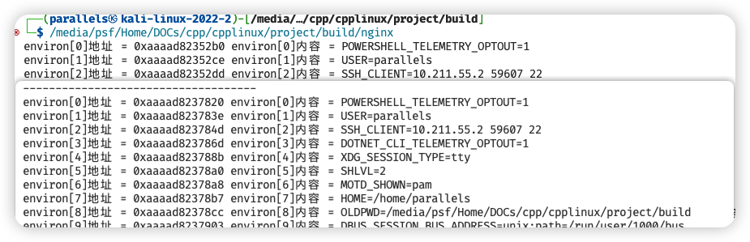

# chap4 - 服务器程序框架初步

## chap4 - 01 - 服务器程序目录规划、makefile 编写

### 信号高级认识范例

在触发 sigusr1 信号并因此 sleep 了 10s 钟期间，就算多次触发 sigusr1 信号，也不会重新触发 sigusr1 信号对应的信号处理函数，
而是会等待上一个 sigusr 信号处理函数执行完毕，才执行第二次 sigusr1 信号处理函数。

换句话说：信号处理函数被调用时，操作系统案例的新信号屏蔽字，自动包括了正在被传递的信号，
因此，保证了在处理一个给定信号的时候，如果这个信号再次发生，那么它会阻塞到前一个信号处理结束为止。

另外，不管发送了多少次`kill -usr1`信号，在该信号处理函数执行期间，
后续所有的 sigusr1 信号统统归结为 1 次。

比如：当前执行 sigusr1 信号的处理程序但没有执行完毕，这个时候，你又发送来了 5 次 sigusr1 信号，
那么当 sigusr1 信号处理程序执行完毕（解除阻塞），sigusr1 信号的处理程序也只会被调用一次（而不会分别调用 5 次 sigusr1 信号的处理函数）

sleep 是可以被信号打断的。
如果在 sig1 中 sleep 10 秒，但是又来了 sig2 信号，
这个时候会进入 sig2 的处理函数中，sig2 退出后，sig1 处理函数中，不会继续 sleep 了。

如果已经 sig1 --> sig2 后，
如果我们再来很多 sig1 和 sig2，这两个信号被会被阻塞。

既然是在执行 usr1 信号处理程序执行的时候，来了 usr2，导致在又去执行了 usr2 信号处理程序，这就意味着，
只有 usr2 信号处理程序执行完毕，才会返回到 sur1 信号处理程序。
只有 usr1 信号处理程序执行完毕了，才会最后返回到 main 中

如果我希望在黑醋栗 sigusr1 信号，执行 usr1 信号处理程序的时候，如果来了 sigusr2 信号，
我不希望调到 usr2 信号处理函数中，我可以用 sigprocmask 来屏蔽信号。

### 服务器架构初步

#### 目录结构规划

- `_include`目录：用于存放各种头文件
- `app`目录：main()函数所在的文件
  - `link_obj`(临时目录，是用 makefile 创建的)
  - `dep`临时目录，会存放临时的`.d`开头的依赖文件，能够告知系统哪些相关的文件发生变化，可以重新编译
  - `nginx.c`：主文件，main()入口函数就放到这里
  - `ngx_conf.c`：普通源码文件，跟主文件关系密切，但又不值得单独放在一个目录
- `misc`目录：专门存放各种杂合性的，不好归类的，1 个到多个源文件
- `net`目录：专门存放和网络处理相关的：.c 文件，暂时为空
- `proc`目录：专门存放和进程处理相关的 .c 文件，暂时为空
- `signal`目录：专门用于存放和信号处理相关的 .c 文件

#### 编译工具 make 的使用概述

每个 .c 生成一个 .o，多个.c 生成多个.o。最终这些.o 被链接在一起，生成一个可执行文件

1. 我们要借助 make 的命令来编译：能够编译，链接，最终生成可执行文件。

大型项目一般都会用 make 来搞（其实应该很多用 cmake 了）

2. make 命令的工作原理，就去当前目录读取一个叫做 makefile 的文本文件。

根据这个 makefile 的规则，把我们这个源代码编译成可执行文件。

当然也有类似的工具生成 makefile（比方说 autotools）

3. makefile 文件：文本文件，utf8 编码格式，一般放在根目录下，也会根据需要放在子目录中

#### 规划一下 makefile 文件

##### 根目录下的 3 个 make 文件

1. makefile：是编译项目的入口脚本，编译项目从这里开始，起总体控制作用
2. config.mk：这是一个配置脚本，会被 makefile 包含。单独分离出来是为了应付可变的东西
3. common.mk：是最核心，最重要编译脚本，用来定义 makfiled 呃编译规则，依赖规则等，通用性很强。并且各个子目录中都用到了这个 common.mk 来编译 .c 文件

##### 各个字母目录下（app,signal）都有一个 makefile 文件

每个 makfile 文件都会包含根目录下的 common.mk，
从而实现自己这个子目录下的 .c 文件的编译

我们将要写的 makefile 不支持目录中嵌套子目录的情况。（只有一级目录）

##### 其他规划

/app/link_obj 临时目录，用来存放 .0 目标文件

/app/dep 存放，d 开头的依赖关系文件

#### makefile 脚本的用法介绍

1. 编译项目：生成可执行文件

2. makefile 很大一部分代码就是描述：依赖关系

时间戳对比

#### makefile 脚本具体实现讲解

<!-- TODO 王健伟老师讲那个 makefile，还是太草了，还得是cmake -->

## chap4 - 02 - 读配置文件、查泄露、设置标题

以`#`开头的行作为注释行，里面除了注释之外不要用中文，
只在配置文件中使用字母、数字、下划线

### 配置文件读取

这个代码是可以直接用在其他项目中的

#### 前提内容和修改

#### 配置文件读取功能实战

### 内存泄露的检查工具

```sh
~/DOCs/cpp/cpplinux/project/build (main*) » brew install valgrind
valgrind: Linux is required for this software.
Error: valgrind: An unsatisfied requirement failed this build.
```

我的评价是：虚拟机，启动！

#### memcheck 的基本功能

1. 使用未初始化的内存
2. 使用已经释放了的内存
3. 使用超过 malloc() 分配的内存
4. 对堆栈的非法访问
5. 申请的内存是否释放
6. malloc/new，new/delete 配对问题
7. memcpy 内存拷贝函数中，原指针和目标指针重叠

#### 内存泄露检查示范

格式：

```sh
valgrind --tool=memcheck [一些开关] [可执行文件名]
```

常见的开关：

`--leak-check=full`完全 full 检查内存泄露

`--show-reachable=yes`显示内存泄露的地点

`--trace-children=yes`是否跟入子进程

`--log-file=log.txt`将调试信息输出到 log.txt，不输出到屏幕

### 设置可执行文件的标题

就是我们可以看到 nginx 有 master 和 worker 的标识，
我们也希望为我们的进程也有名字标识

```sh
┌──(parallels㉿kali-linux-2022-2)-[/usr/local/nginx/sbin]
└─$ ps -ef | grep nginx
root      390932       1  0 11:43 ?        00:00:00 nginx: master process ./nginx
nobody    390934  390932  0 11:43 ?        00:00:00 nginx: worker process
paralle+  391023  385265  0 11:43 pts/0    00:00:00 grep --color=auto nginx
```

修改标题，也就是修改：`argv[0]`。
但是这是有问题的，如果 len(newstr) > len(argv[0])，
那么在 strcpy(newstr, argv[0])就有可能导致下标越界的情况。

实际上：argv[0]、argv[1]、...、argv[argc-1]这些是连在一起的。
如果 argv[0]过长，就会覆盖 argv[1]...

argv 之后，紧挨着的是：环境变量信息`extern char** environ`。
argv 内存 与 environ 内存紧挨着

困难就是：不仅仅会破坏 argv[1]...的内存，还可能会破坏 environ 的内存。

思路：

1. 重新分配内存，用来保存 environ
2. 修改 environ[0] 所指向的内存
3. 给 environ 设置 内存释放 代码
4. 修改进程标题

environ 搬家成功：



## chap4 - 03 - 日志打印、优化 main 函数调用流程

### 日志打印实战

日志的重要性：供日后运维人员去查看、定位 和 解决问题

新文件：ngx_pringf.cxx 和 ngx_log.cxx

#### 日志等级划分

#### 配置文件中 与 日志 有关的选项

### 设置时区

设置时区：

1. PST（美国太平洋标准时间）
2. GMT（格林尼治）
3. UTC（通用协调时）
4. CST（北京时间）

因为日志需要时间的打印

### 捋顺 main 函数中代码执行流程

1. 最先调用无伤大雅的东西
2. 其次是：调用失败就会导致程序退出的东西：配置读取等
3. 然后是：打开日志文件
4. 其他类别的代码（不好归类的）：环境变量搬家 --> 设置进程标题

5. 释放资源，写成一个函数

## chap4 - 04 - 信号、子进程实战、文件 IO 详谈

### 信号功能实战

热更新、重启子进程

商业软件中，不用 signal() ，而要用 sigaction()

sigaction 初步，看代码

### nginx 中创建 worker 子进程

官方 nginx，一个 master 进程，创建了多个 worker 子进程

#### sigsuspend() 函数详解

### 日志输出重要信息 谈

#### 换行回车进一步演示

#### printf() 函数不加 \n 无法及时输出的解释

### write() 函数思考

#### 掉电导致 write() 的数据丢失破解法

### 标准 IO 库
