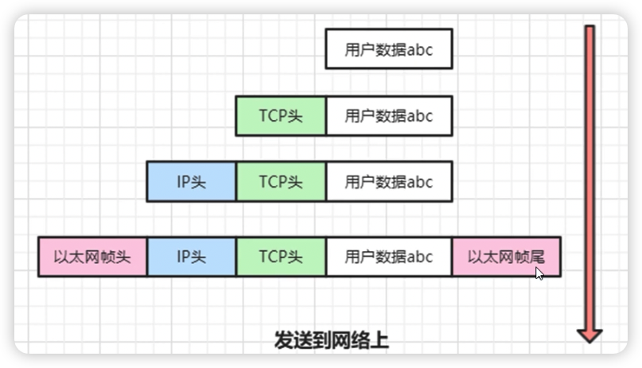
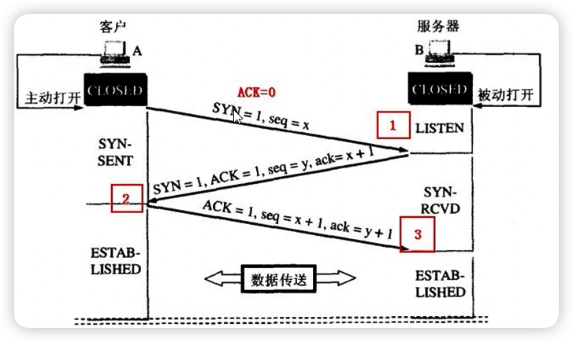
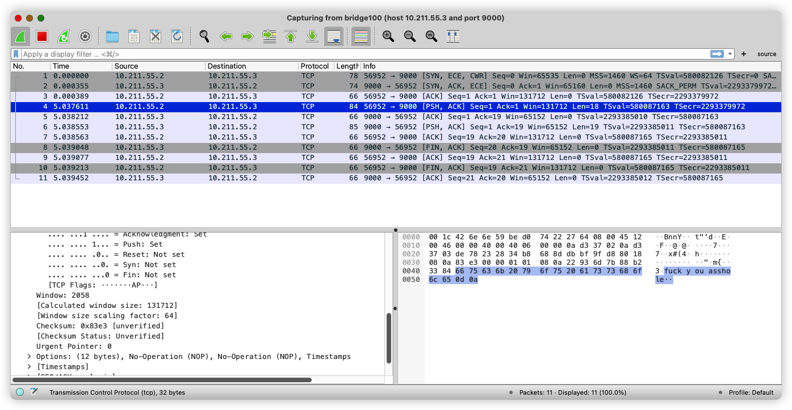
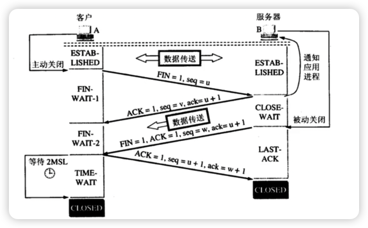
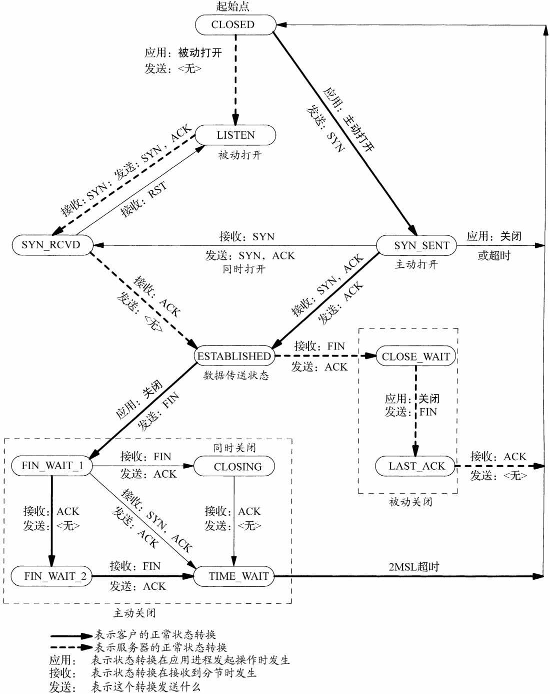
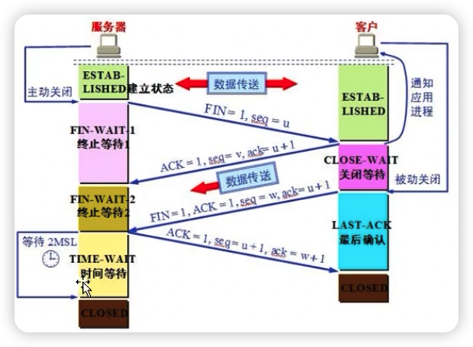
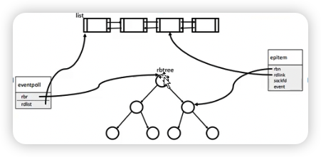

# chap5 - 网络通讯实战

## chap5 - 01 - TCP/IP 协议妙趣横生

### 客户端 与 服务器

客户端，服务端 都是 一个程序

#### 解析一个浏览器访问网页的过程

#### 客户端 服务器 角色 规律总结

1. 数据通讯总在两端进行，其中一端叫做客户端，另一端叫做服务器端

2. 总有一方要先发起数据，这发起第一个数据包的一段，就叫客户端; 被动接受第一个数据包这端，就叫服务器端

3. 连接建立起来，数据双向流动，这叫双工【你可以发数据包给我，我也可以发数据包给你】

4. 既然服务器端是被动接收连接，那么客户端必须能够找到服务器在哪里

比方说，我的浏览器要访问 taobao，我需要知道 taobao 服务器的地址【ip 地址，192.168.1.1】，
以及 taobao 服务器的姓名【端口号，这是一个 无符号数字，范围 0 ～ 65535】，浏览器默认是访问 80 端口（http）

taobao 服务器【nginx 服务器】会调用 listen() 函数监听 80 端口

在编写网络通讯程序时，只需要指定 taobao 服务器的 ip 地址 和 淘宝服务器的端口号，就能够跟 taobao 服务器 进行 通讯

5. epoll 技术可以支持 数十万 的连接

### 网络模型

#### OSI 七层网络模型

哪 7 层？顺口溜：物【物理层】 链【数据链路层】 网【网络层】 传【传输层】 会【会话层】 表【表示层】 应【应用层】

open system interconnect（osi）：开放式系统互联：ISO 国际标准化组织，在 1985 年研究出来的一个模型

物理层：网卡、硬件等

应用层：为应用程序提供服务

把一个要发送出去的数据包，从里到外裹了 7 层; 最终把包裹了 7 层的数据包发送了出去

（这个会在《计网》中应该会 详细学习）

#### TCP/IP 协议 四层模型

transfer control protocol（传输控制协议） / internet protocol （网际协议） (TCP/IP)

tcp/ip 实际上是 一组 协议 的代名词，而不仅仅是一个协议

- 链路层（物、链） --> ARP、以太网帧、RARP
- 网络层（网） --> ICMP、IP、IGMP
- 传输层（传）--> TCP、UDP
- 应用层（会、表、应） --> 用户进程

把数据包，裹了 4 层

TCP/IP，其实每一层都对应着一些协议

重点理解：

以太网帧 <--> IP <--> TCP <--> 用户进程

#### TCP/IP 协议的解释和比喻

要发送 abc --> 加 tcp 头 --> 加 ip 头 --> 加 以太网帧 头和尾

加上 3 头 1 尾



### 最简单的用户端 和 服务器程序实现代码

下面这两个 服务器程序、客户端程序，只具备演示价值

推荐书籍：《unix 网络编程》

#### 套接字 socket 概念

socket（套接字）：就是一个数字，通过调用 socket()函数生成的，这个数字具有唯一性;
当调用 socket()，操作系统给你返回的话，这个数字会一直给你用，直到你调用 close()，
把这个数字关闭（有点 fd 的意思），才会把这个数字回收。

unix 哲学：一切皆文件，所以我们也把这个 socket 也堪称是文件描述符，
我们可以用 socket 收发数据：send()，recv()

#### 一个简单的服务端 通讯程序 范例

注意：服务器端 与 客户端 程序是不一样的。

listenfd = socket() --> bind(listenfd, addr) --> listen() --> connfd = accept()【等待客户端连我，阻塞】
--> write(connfd) --> close(connfd) --> close(listenfd)

就是这里先有了 socket，socket 是一些随机码之类的，后面我们要让 `socket码` 与 `host ip` 绑定

#### IP 地址 简单谈

ipv4 地址：理解成现实社会中的 居住地址

#### 一个简单的客户端 通讯程序 范例

建立连接时，双方彼此都要有 ip 地址、端口号。

连接一旦建立起来，那么双方的通讯【双工收发】，
就只需要用双方彼此对应的 socket 即可。

#### 客户端 服务器程序 综合演示 和 调用流程图

### TCP 和 UDP 的区别

我们可以看到：UDP、TCP 都是 “传输层”

UDP：不可靠，无连接的（有种无线网络的感觉），
发送速度特别快，但无法确保数据的可靠性。
可能后发出的数据先到达。

TCP：可靠，有连接的（有种有线网络的感觉），
TCP 可靠，必要要更多的系统资源确保数据传输的可靠。
得到的呃好处就是：只要不断线，传输给对象的数据，一定正确，不丢失，不重复，按顺序到达对端

应用场景：

- tcp: 文件传输，一般 TCP 对 UDP 用的范围 和 场景更广
- udp: qq 聊天信息，聊天信息巨大，服务器懒得整，但是 qq 内部有一些算法导致丢包率下降

《TCP/IP 协议详解》

## chap5 - 02 - TCP 三次握手详解、telnet、wireshark 示范

### TCP 连接的三次握手

只有 tcp 有三次握手【连接的时候】

#### 最大传输单元 MTU

mtu (maximum transfer unit)，最大传输单元

每个数据包 包含的数据最多可以有多少个字节？1.5k 左右（真正传输的数据，大概是 1.4k 左右，加上一 3 头 1 尾之类的）

你要发送 100k，操作系统内部会把你这 100k 数据拆分成若干个数据包，
每个数据包大概 1.5k 之内。

我们只需要有：拆包、组包 这个过程就行了，细节不用掌握

我们拆开的包，各自传输的路径可能不同，每个包可能因为路由器、交换机等原因被再次分片。

最终 tcp/ip 协议，保证了我们收发数据的顺序性和可靠性

#### TCP 包 头结构

就是一个 struct，

0. 前面的头
1. 源端口，目标端口（这里就没有 ip 了，ip 有 IP 头）
2. 32 位序列号
3. 32 位确认号
4. tcp 头部大小（4 位） + 预留 4 位 + 一些开关（关注 syn 位和 ack 位 ）+ 16 位窗口大小
5. 16 位校验值 + 16 位紧急指针
6. tcp 选项
7. data（可选）

每层是 32 位的。

有的数据包里可能是没有 数据（data） 的

#### TCP 数据包收发之前的准备工作

回忆日志操作的步骤：

1. 打开日志文件
2. 多次，反复的往日志文件中写信息
3. 关闭日志文件

tcp 数据的收发是双工的：每端既可以收数据，也可以发数据。

tcp 数据包的发送也分三大部分：

1. 建立 tcp 连接，三次握手(connect)
2. 多次反复的数据收发(read/write)
3. 关闭 tcp 连接(close)

udp 不存在三次握手来建立连接，因此 udp 实际上不存在建立连接的步骤，
udp 数据包是直接发送出去的

#### TCP 三次握手建立连接的过程

客户端理解成一个人，服务器理解为一个人，两个人要用电话通话：

1. 张三（客户端）：你好，李四
2. 李四（服务端）：你好，张三，我是李四
3. 张三：你好，李四



1. 客户端 ---（SYN=1，无 data）---> 服务器
2. 服务器 ---（syn=1，ACK=1，ack=xxx，无 data）---> 客户端
3. 客户端 ---（ACK=1，ack=xxx，无 data）---> 服务器

三次握手成功 建立连接后，才会开始传送 应用层 的数据

#### 为什么 TCP 握手是 三次 而不是 两次

tcp 握手是三次，而不是二次。

比方说诈骗：

1. 假冒公安局（客户端）：你的身份证号是 xxxx，你的名字是 xxxx
2. 你是妖妖灵？那我给你打回去，啪，挂断电话，打回去（笑了）

TCP 三次握手的最主要原因之一： 1. 尽量减少伪造数据包对服务器的攻击

上面的三次中

服务器给客户端发送 ack 包，只有客户端再次返回 ack 相关的包，那么才能建立连接。

因为真正的收发数据，是有成本的。如果伪造了许多假的客户端连接服务器，那么服务区吃不消的。
阻碍了正常的业务。

### telnet 工具使用介绍

是一款命令行方式运行的 客户端 tcp 通讯工具，可以连接到服务器端，
往服务器端发送数据，也可以接收从服务器端发送过来的数据。
有点像上一节课写的客户端代码

```sh
telnet <ip地址> <端口号>
```

可以用来测试服务器端的端口开了没有

### wireshark 监控数据包

在 capture 中，先关闭抓包，然后选择 option，然后设置 filter

```wireshark
host 10.211.55.3 and port 9000
```



#### TCP 断开的 4 次挥手

这个谁先发送不一定的，看是谁先断开

1. FIN ACK 服务端 --> 客户端
2. ACK 服务端 <-- 客户端
3. FIN ACK 服务端 --> 客户端
4. ACK 服务端 <-- 客户端



## chap5 - 03

### TCP 状态转换

同一个 ip，同一个端口，只能被 bind 一次，
就会调用失败，并且显示错误信息`address already in use`，
就好像，一个班级里，学号一定是不一样的一样。

介绍命令：netstat，是用来显示网络相关信息的，端口状态之类的

`-a`参数，用来显示所有选项

`-n`全部显示成数字

`-p`显示端口对应的策划那个续命

```sh
(base) ┌──(parallels㉿kali-linux-2022-2)-[/media/…/DOCs/cpp/cpplinux/chap5]
└─$ netstat -anp | grep -E 'State|9000' # 这个State表示，是显示状态行
Proto Recv-Q Send-Q Local Address           Foreign Address         State       PID/Program name
tcp        0      0 0.0.0.0:9000            0.0.0.0:*               LISTEN      53806/hello5_3_1_se
Proto RefCnt Flags       Type       State         I-Node   PID/Program name     Path
```

`0.0.0.0`表示，本机的任意地址，也就是`serv_addr.sin_addr.s_addr = htonl(INADDR_ANY)`

此时，telnet 连接服务器端，这个时候再次查看网络状态

```sh
(base) ┌──(parallels㉿kali-linux-2022-2)-[/media/…/DOCs/cpp/cpplinux/chap5]
└─$ netstat -anp | grep -E 'State|9000'
Proto Recv-Q Send-Q Local Address           Foreign Address         State       PID/Program name
tcp        0      0 0.0.0.0:9000            0.0.0.0:*               LISTEN      53806/hello5_3_1_se
tcp        0      0 10.211.55.3:9000        10.211.55.2:61137       TIME_WAIT   -
tcp        0      0 10.211.55.3:9000        10.211.55.2:61136       TIME_WAIT   -
```

我们用两个客户端连接到服务器，服务器给每个客户端发送一串字符，并关闭客户端。
我们用 netstat 观察：原来的 监听端口一直是【listen】，但是当来了两个连接之后【连接到服务器的 9000 端口】，
虽然这两个连接被 close 掉了，但是产生了两条【TIME_WAIT】信息（【两条】是因为有【两个客户端】）

但是如果我，重启服务器，这个时候会失败，提示是：address already in use，是因为依然有两个【TIME_WAIT】，
确实，我上面在玩那个 telnet 的时候，确实遇到了这个小问题。

现象总结：只要客户端 连接到服务器，并且 服务器把客户端关闭，那么服务端就会产生一条 9000 监听端口的 状态为 TIME_WAIT 的连接。
那么此时重启服务器，bind 返回失败

这个是一个 TCP 转换的问题：《unix 网络变成 卷 1》2.6（TCP 状态转换图）、2.7（专门介绍了 TIME_WAIT 状态）

TCP 状态转换图（一共有 11 中状态），是针对【一个 socket 连接】而言的：
【一个 socket 连接】处于这 11 种状态的一种。



四次挥手，谁主动 close 连接，谁就会给对象发送一个 【FIN 标志位】的一个数据包给对方。
我们的代码中，是服务器发送的。

### TIME_WAIT 详解

TIME_WAIT 状态的产生

主动关闭的一方： ESTABLISHED ---(服务器给客户端发送 FIN)---> FIN_WAIT_1
---(服务器收到了客户端的 ACK)---> FIN_WAIT_2 ---（服务器接收到了客户端的 FIN）---> TIME_WAIT
---(等待 2MSL，大概是 1 ～ 4min)---> CLOSE

被动关闭的一方： ESTABLISHED ---(客户端接收到了服务器的 FIN)---> CLOSE_WAIT
---（再次发送 FIN）---> LAST_ACK ------> CLOSE

这个 TIME_WAIT 就好像是：退出不够利索。当这种状态存在的时候，重启服务器就会失败



《unix 网络编程》对 time_wait 的描述：

上面图的四次挥手中，如果 3th 包丢了，
客户端会在一定时候以后，重新发送 3th 包，
有 time_wait 的存在，那么服务器还有机会接收到这个【重发的 3th 包】。
然后服务器发送 4th 包给客户端，客户端接收到了 4th 包，LAST_ACK 结束--->CLOSE。

（1）可靠的实现 TCP 全双工的终止

如果没有 time_wait，服务端接收到了 fin 包，会给客户端发送 rst 包（而不是 ack 包），
那么客户端收到 rst 包时，某些函数如果没有考虑到这次状态 会报错。（会跳入有限状态机的 IDLE 状态，不正确的假设，鲁棒性）
（而且这个 RST 还有可能会导致数据的丢失）

（1.1）RST 标志

对于每一个 TCP 连接，操作系统是要开辟出来一个 收缓冲区，和一个 发送缓冲区 来处理数据的 收 和 发。
当我们 close 一个 tcp 连接时，如果我们这个发送缓冲区还有数据，那么操作系统会很优雅的把发送缓冲区里的数据发送王壁，
然后再发 fin 包表示连接关闭。

【FIN 四次挥手】是一个优雅的关闭标志，表示正常的 TCP 连接关闭。

【RST 标志】出现这个标志的包，一般都表示：异常关闭; 如果发生了异常，一般都会导致丢失一些数据包。
不是正常的四次挥手关闭，所以如果你这么关闭 tcp 连接，那么主动关闭一方也不会进入 TIME_WAIT。

如果将来用 setsockopt(SO_LINGER) 选项要是开启，【服务器接收到了 RST】如果服务器的发送缓冲区里面有 数据，那么这个数据会被直接丢弃。

（2）允许老的重复的 tcp 数据包在网络中消逝

2MSL 是数据包最长生命周期 的 两倍。
等待存留在网络上的数据包被 路由器等 杀死。
防止再次启动服务器以后，被服务器识别。

### SO_REUSEADDR

`setsockopt(SO_REUSEADDR)`用在服务端 socket 创建之后，bind()之前。

四个能力：

（1）SO_REUSEADDR 允许启动一个监听服务器并绑定器端口，即使 TIME_WAIT 状态存在，服务器 bind()依然能够成功

（2）允许同一个端口上，启动同一个服务器的多个实例，只要每个实例捆绑一个不同的本地 IP 地址即可;

（3）允许同一个进程绑定同一个端口到多个 socket，只要每次捆绑指定不同的本地 IP 地址即可

（4）允许完全重复的绑定：当一个 IP 地址和端口已经绑定到某个 socket 上时，如果传输协议支持，
同样的 ip 地址和端口还可以绑定到另一个 socket 上 Lyiban 来说，本特性仅支持 UDPsocket

**所有 TCP 服务器都应该支持本 socket 选项**，以防止当 socket 处于 TIME_WAIT 时 bind()失败

```c
int listenfd = socket(AF_INET, SOCK_STREAM, 0);

int reuseaddr = 1; // 这里的1表示确实启用该选项，这个函数的接口很奇怪
if (setsockopt(listenfd, SOL_SOCKET, SO_REUSEADDR, (const void*)&reuseaddr, sizeof(reuseaddr)) == -1) {
    char* peeorinfo = strerror(errno);
    printf("setsockopt(SO_REUSEADDR)返回值为-1, 错误码为:%d, 错误信息为:%s;\n", errno, peeorinfo);
}

bind()
```

## chap5 - 04 - listen()队列、阻塞非阻塞、同步异步

### listen() 队列剖析

listen() 函数：监听端口，用在 TCP 连接中的 服务端 角色

`int listen(int sockfd, int backlog)`

要理解好 backlog 这个参数，我们需要先谈一谈 “监听 socket 队列” 这个问题。

对于一个调用 listen()进行监听的 socket，操作系统会给这个 socket 维护两个队列

1） 未完成连接队列【保存连接用的】

当 client 发送 tcp 连接【三次握手】的第一次【syn 包】给服务器的时候，
服务器就会【未完成队列】中创建一个 跟这个 sync 包对应的一项。
其实，我们可以把这项看成是一个【半连接】，这个半连接状态会从【LISTEN】变为【SYNC——REVD】状态，
同时给 client 返回【第二次握手包 syn ack】。这个时候，其实服务器是在【等待完成第三次握手】
（当然，正常情况下，client 会返回 ack 包）

2） 已完成连接队列【保存连接用的】

当【第三次握手完成】了，这个连接就变成了 ESTABLISHED 状态，每个【已经完成三次握手】的客户端
都放在这个队列中作为一项。

backlog（积压的意思），已完成队列 + 未完成队列 <= backlog

（1）客户端这个 connect()返回的时机：收到【第二次握手包 syn ack】之后就返回了。

（2）RTT 是 【未完成队列中任意一项在未完成队列中 滞留的时间】，这个时间取决于客户端和服务器。
RTT 是【服务器接收到 syn】---> 【服务端接收到了 ack】的时间。差不多就是：【2th 3th 握手】的时间。
客户端的 RTT 是【1th 2th 握手】的时间（其实这个关注一下 未完成 就行了）
。如果这三次握手传递速度比较快的话，大概是 187ms。

如果恶意用户，迟迟不发送【第三次握手】，那么【半连接队列】就会满，
半连接队列中的一项，滞留时间是 75s

#### accept() 函数

accept()：就是从【已完成队列】中的【队首】位置取出来一项，返回给进程。
【已完成队列】中的每一项就是一个 socket。

在我们的程序`hello5_3_2_server.c`中，如果【已完成队列】为空，
那么就会【休眠】等待（cpu 时间片切换给其他进程），一直到 已完成队列 中的有一项时，才会被唤醒。
所以，从编程角度，我们要 "尽快" 的用 accept()把已完成队列终端的数据取走！
（这里注意一下，实际上，client 的 accept 返回的比 server 的 accept 返回的早），
这个套接字就代表【已经用三次握手建立起来】的【tcp 连接】，因为 accept() 是从：【已完成队列】中取的数据。

有两种 socket

1. 监听 9000 端口这个 socket，【监听 socket（listenfd）】，只要服务器程序在运行，这个 socket 就应该一直存在
2. 当 client 连接进来，操作系统会为每个【成功建立三次握手】的 client 再创建一个 socket（accept 返回的 socket），随后 server 使用这个 socket(connfd) 与 client 通信

#### syn 攻击【syn flood(溢出)】

如果一个恶意用户，不停地给服务器发送 syn 包，
使得 未完成队列 + 已完成队列 > backlog，
那么有正常用户就连不进来了。（拒绝服务工具 Dos）（如果甚至是分布式，也就是 DDOS，那确实坏菜了）

backlog 进一步被规定了：【已完成队列】中，最大积压数。
但是其实并没有解决根本问题。

当然 backlog 也不能太大，内核对这个有上限。

#### 思考题 1

（1）队列满了会忽略

如果 已完成队列 + 未完成队列 > backlog，也就是队列满了，
此时，如果再有一个 client 发送 sync 请求，服务器会怎么反应？

实际上，服务器会忽略这个 syn 包，不给回应。client 这边，发现 syn 没反应，过一段时间会重发。
应该是连着 3 次发送失败，client 的 accept 就会返回失败。

（2）有缓冲区

从连接被扔到【已完成队列】中去，到 accept()从【已完成队列】中取出来，这是有时间差的。

如果 server 还没来得及返回这个 socket，client 就发来数据，这个数据数据就会被保存在：
已经连接的 socket 的接收缓冲区里。

### 阻塞 与 非阻塞 IO

指的是：调用一个系统函数时，这个函数是否会导致我们的进程进入 sleep

（1）阻塞 IO：

调用一个个呃函数，这个函数就卡在这里，整个程序不往下走了。等待一个事件的发生，
只有事件发生了，这个函数才会往下走

这种阻塞并不好，效率很低。
因为操作系统其实是给每个进程一个时间片，
然而我们没有用完 "时间片" 就休眠了，
我们这个进程就变成了 "活雷锋" 了。

一般我们不希望用【阻塞的方式】来写服务器程序，效率很低。

默认情况下`int listenfd = socket(AF_INET, SOCK_STREAM, 0);`是阻塞的，
所以我们的`listen(listenfd, 32) == -1`也是阻塞的。

（2）非阻塞 IO：

就是 轮询 的方式，不断的调用 accept()来检查有没有数据到来;
如果没有，函数会返回一个特殊标记来告诉你，这种标记可能是 EVULDBLOCK，也可能是 EAGAIN;
（如果数据没到来，那么这里有机会执行其他函数，但是也得不停再次调用 accept()来检查是否有数据到来，非常累）
如果数据到来，还是得卡一小会儿：把内核缓冲区中的数据拷贝到应用程序的缓冲区。

#### 异步 IO

什么是同步？什么是异步？这个概念与：阻塞/非阻塞混淆

（1）异步 IO

aio_read()是一个异步 IO 函数，需要给 aio_read()提供一个 buf 和一个回调函数。
调用完一个异步 IO 函数后，该函数就会立即返回，其余的事情就交给操作系统：
操作系统会判断数据是否到来，如果数据到来，操作系统就会把数据拷贝到 buf 中，
然后调用回调函数来通知你。

作为这个异步函数的使用者，我们要把这个【回调函数】看成一个通知，
只要【通知（回调函数）】被调用，那么就是来数据了。

“非阻塞” 与 “异步 IO” 的区别：

1. 非阻塞 IO 要不停调用 IO 函数，非常累。

2. 异步 IO 根本不需要调用 IO 函数是否检查数据是否到来。只需要调用一次，然后就可以干其他事去了。
   内核判断数据带来，拷贝数据到你提供的缓冲区，调用你的回调函数来通知你，并没有被卡在那里的情况。

（2）同步 IO

几种模型：select、poll、epoll，以 select 为例，调用流程如下：

1. 调用 select()判断有没有数据，有数据走下来，没数据，卡住

2. select()返回之后，用 recvfrom()去获取数据。当然，取数据的时候也会卡一下（内核缓冲区-->应用程序缓冲区）
   同步 IO 感觉更麻烦，要调用两个函数才能把数据拿到手;
   但是同步 IO 不阻塞 IO，多了：IO 复用的能力。

   所谓 IO 复用，就是多个 socket 连接，可以捆成一堆，我可以用 select 这种同步 IO 函数在这等数据。

   select()的能力就是：等多条 TCP 连接上的任意一条有效数据来，哪条 tcp 有数据来，我再用具体的函数去接收（比方说 recvfrom）

   所以这种调用一个函数 能够 判断一堆 TCP 连接是否 “来数据” 的这种能力，叫 IO 复用（IO multiplex）

很多资料：把 同步 IO，阻塞 IO，非阻塞 IO 归为一类，因为他们都有阻塞的行为发生。
只有异步 IO 是真的没有阻塞的（拷贝发生在内核的时间中）

#### 思考题 2

什么叫做：用 异步的方法 使用 非阻塞调用？

非阻塞就是：轮询。

异步就是：cpu 时间片直接让了出去

## chap5 - 05 - 监听端口实战、epoll 介绍及原理详解

### 监听端口

#### 开启监听端口

### epoll 技术简介

上面，同步 IO 有两个函数，一个用来等待 socket，
一个是用来处理数据的

#### epoll 概述

epoll 就是一种典型的 IO 多路复用技术，
epoll 技术的最大特点就是：支持高并发。

除了 epoll 还有 kqueue(freebsd)

### epoll 原理 与 函数介绍

#### 课件介绍

NtyTcp 项目，里面有手动实现 epoll，
几个文件，比较好的：nty_epoll_rb.c，nty_epoll.c

还有一个 c1000k 项目

#### epoll_create()函数

调用格式

```sh
// size > 0
int epoll_create(int size);
```

创建一个 epoll 对象，返回 “句柄”

epoll 对象最终要用 close()，因为 句柄 总是要关闭的。

原理：

1. 分配了一段内存，创建了一个对象 eventpoll
2. rbr 结构成员：指向红黑树的根节点的指针。刚开始指向空
3. rdlist 结构成员：双向链表的 表头指针

4. 初始化红黑树
5. 创建双向链表

红黑树用来保存 key-value，有序表。查找效率很高

#### epoll_ctl()函数

功能：把一个 socket 以及这个 socket 相关的事件添加到这个 epoll 对象描述符中，
目的就是通过这个 epoll 对象监视这个 socket【客户端的 tcp 连接】

我们把感兴趣的事件通过 epoll_ctl()添加到系统。当有数据来往时，系统会通知我们。

```cpp
int epoll_ctl(int fdpd, int op, int sockid, struct epoll_event *event)
// fdpd: epoll_create() 返回的epoll对象描述符
// op: 动作，添加、删除、修改，对应数字是1(EPOLL_CTL_ADD)、2(EPOLL_CTL_DEL)、3(EPOLL_CTL_MOD)
   // 添加节点，就相当于是给红黑树上添加节点。每个客户端连接服务器后，服务器都会产生一个对应的socket，每个连接这个socket都不重复。
   // 修改节点上value：就是把红黑树对应的节点，他的value修改
   // 删除key：从红黑树上把这个节点干掉，这会导致这个socket上无法收到任何系统通知
   // 这个数据结构的索引：父节点，左右孩子节点，用一段内存rbn包裹着。
// socketid: 表示客户端连接，就是从accept()。
// event：事件信息，这里包括的是一些事件信息，ADD和MOD都要用到这个event参数里面的事件信息
```

如果有 100w 并发的话，那么就是往这个红黑树中插入 100w 个节点。

#### epoll_wait()函数

当事件发生，我们如何拿到操作系统的通知？

功能：阻塞一小段时间并等待事件发生，返回事件集合，也就是获取内核的事件通知。
也就是：遍历双向链表，把双向链表节点数据拷贝出去，拷贝完毕的，就从双向链表中移出。

双向链表中记录的是：所有有数据的 socket【tcp 连接】。

就是我的 100w 个 socket 连接，实际有事件的，可能也就 100 个，这 100 个是放在 双向链表 中的。

```cpp
int epoll_wait(int epfd, struct epoll_event * events, int maxevents, int timeout);
// epfd: 是epoll_create()返回的epoll的句柄
// events: 是内存，也就是数组，长度是 maxevents，表示此次epoll_wait调用可以搜集到的maxevents个事件【】
// timeout: 等待的时间长度
// 返回: min(maxevents, ep->rdnum)事件数量
```

某个 socket 在这个双向链表中，这个 socket 上就一定发生了某个事件，
只有发生了某个事件的 tcp 连接，才会被扔到这个双向链表中

epoll 为什么搞笑，就是因为每次值遍历了 【发生了事件的】这一小部分 socket

epitem 结构设计的高明之处：既能作为 红黑树的节点，也能作为 双向链表的节点



#### 内核 向 双向链表添加节点

四种情况：

1. 客户端完成三次握手，服务器要 accept()
2. 当客户端关闭连接，服务器要 close()关闭
3. 当客户端发送来数据，服务器要调用 read()，recv()来接收数据
4. 当可以发送数据时（防止把客户端噎死），服务器可以调用 send()，write()

#### 源码阅读 额外说明

有许多 加锁机制`pthread_mutex`

## chap - 06 - 通讯代码 epoll 实战 1

### 连接池的作用

将一个 socket 与一块内存绑定起来，用来保存一些信息，这块内存事先声明好。
`lp`就表示指针的意思。

保存的信息如下：

```c
struct ngx_connection_s {
    int fd;
    lpngx_listening_t listening; // 被谁监听的

    unsigned instance : 1; // 位域：0有效，1失效
    uint64_t iCurrsequence; // TODO

    struct sockaddr s_sockaddr;
    // char addr_text[100]; // 地址的文本信息

    // uint8_t r_ready; // 读准备好的标记
    uint8_t w_ready; // 写准备好的标记

    ngx_event_handler_pt rhandler; // 读的相关处理方法
    ngx_event_handler_pt whandler; // 写的相关处理方法

    /* 相当于是 next，空闲链 */
    lpngx_connection_t data;
};
```

### 指针 位域 合二为一

```c
ev.data.ptr = (void*)((uintptr_t)c | c->instance);
```

因为要内存对齐，一个数据，他的内存，最后一位通常是 0，
那么就可以用来保存 一位 信息。

### 配置文件的修改

要加一个东西`worker_connections = 1024`，一个 worker 进行允许连接的客户端数。
当然，实际上我们会限制，如果达到这个数字的 8/9，我们就不会继续接收连接了（这个时候算是饱和了）

### epoll 函数实战

#### lsof

```sh
lsof -i:80 # 可以查看有哪些进程在监听80端口
```

还可以使用命令

```sh
netstat -tunlp | grep 80
```

## chap5 - 07 - 通讯代码

上节课，我们已经准备好了和 等待迎接 client 主动发起三次握手连入

我们将介绍：ngx_epoll_process_events

从 ngx_epoll_process_events()函数调用位置，我们可以感觉到：

1. 这个函数，仍旧是在子进程中被调用
2. 这个函数，放在子进程 for(;;)，这意味着这个函数会被不断的调用

用户三次握手成功，client 连入进来，“连入进来” 这个事件对于我们服务器来讲，就是 一个 "监听 socket" 上的可读事件

### 事件驱动

官方 nginx 本身的架构也被称为 “事件驱动架构”

驱动：汽车靠发动机驱动、人体的发动机就是心脏。驱动就是动力的来源。
驱动的问题就是，探讨程序怎么来干活的问题。

事件驱动：通过获取事件，通过调用到事件 并 根据这个事件来调用适当的函数，从而让整个程序干活。

#### epoll_wait 往下走

1. **有事件发生**：当至少一个被监控的文件描述符上有请求的 I/O 事件发生时，`epoll_wait` 会返回。返回值是发生事件的文件描述符数量，并且它将事件的详情填充到传递给它的事件数组中。

2. **超时**：`epoll_wait` 函数的超时参数指定了调用者愿意等待事件的最长时间（以毫秒为单位）。如果在指定的时间内没有任何事件发生，`epoll_wait` 将返回 0。如果超时参数被设置为 -1，`epoll_wait` 将无限期等待，直到某个事件发生。

3. **被中断**：如果 `epoll_wait` 调用在有事件发生之前被信号中断，它可能会提前返回。在这种情况下，返回值通常是 -1，并且 `errno` 被设置为 `EINTR`。

#### epoll_wait 返回值

`epoll_wait` 函数的返回值表示不同的情况：

1. **正值**：当 `epoll_wait` 返回一个正整数时，这个值表示在你指定的超时时间内，有多少个文件描述符发生了事件。这个数值可以是从 1 到你请求的最大事件数，这个最大事件数是你在调用 `epoll_wait` 时，作为参数传递的。返回后，你可以检查传递给 `epoll_wait` 的事件数组，来确定哪些文件描述符有事件发生，并进行相应的处理。

2. **零值**：如果 `epoll_wait` 返回 0，这意味着在指定的超时时间内没有任何事件发生。这是一个正常的超时情况，并不表示错误。

3. **负值**：当 `epoll_wait` 返回 -1 时，说明在等待过程中发生了错误。这时，你应该检查全局变量 `errno` 来了解错误的具体原因。常见的错误有：
   - `EBADF`：`epfd` 不是一个有效的文件描述符。
   - `EINTR`：调用在事件发生之前被信号处理器中断。
   - `EINVAL`：`epfd` 不是一个 `epoll` 文件描述符，或者 `maxevents` 的值小于或等于零。

#### ngx_accept

#### ngx_epoll_process_events

### epoll 的两种工作模式

如果没有指定 epoll 工作模式，默认使用 LT

现状：所有的监听 socket 用的都是：LT;
所有的介入进来的用户 socket 都是：ET

#### LT

LT: level trigged: 水平触发，低速工作模式（效率低）

意思就是：来一个事件，如果不去处理它，那么这个事件就会一直被触发。

比方说，一个新用户，三路握手，连入进来了，如果没有处理函数，
这个 epoll_wait 就会一直返回。

不去处理的意思就是，不调用处理函数，
具体 epoll 是如何检测到是否调用了处理函数：fd 状态的改变，看 comment.md，
listen 要水平触发：为了防止有疏漏，以免忽略了用户的请求

#### ET

ET: edge trigged: 边缘触发，高速工作模式（效率高）。

这种 ET 触发，只有 非阻塞 socket 才有用。
来个一个事件，内核只会提醒一次，编码的难度加大。
因为只通知一次，所以接到通知后，必须要保证把该处理的事情处理利索;（比方说，缓冲区要读完）

#### ev.events

在使用 `epoll` 进行 I/O 多路复用时，你需要指定感兴趣的事件类型，
以便 `epoll` 能够通知你相应的事件发生。这是通过设置 `epoll_event` 结构体的 `events` 字段来完成的。
在这个字段中，你可以使用位或操作（`|`）来组合多个事件标志。

这里的 `ev.events = EPOLLIN | EPOLLRDHUP;` 表示：

- `EPOLLIN`：表示对应的文件描述符可以读取（即，数据可读，包括普通文件、TCP/UDP 套接字等）。

- `EPOLLRDHUP`（在 Linux 2.6.17 以上版本中可用）：表示套接字的另一端已经关闭，或者半关闭了连接。
  如果你在 `epoll` 文件描述符上接收到这个事件，它通常表示对方已经执行了 `shutdown` 操作在写入方向上，或者完全关闭了连接。

因此，这行代码的意思是，你正在设置 `epoll` 事件类型为两种情况：要么是有数据可以读取，要么是连接的对方关闭了连接。
当其中任何一种情况发生时，`epoll_wait` 会返回这个文件描述符，表示它准备好进行相应的操作了。

这样设置的目的是使得你的程序可以对数据读取做出响应，
并且能够检测到对方是否关闭了连接，这样你可以适当地关闭你这一端的连接，释放资源。

### 总结和测试

1. 服务器能够感知到客户端发送过来 abc 字符了
2. 来数据会调用 ngx_waitrequest_handler()

### 事件驱动总结

事件驱动框架：

搜集：epoll_wait

消费：消费函数


## chap5 - 08

### ET、LT 模式深入分析 及 测试

#### ET 的问题

如果 read，如果每次只 读取 2 个字符 到 缓冲区（内核缓冲区 --> 应用程序缓冲区）

```c
void CSocket::ngx_wait_request_handler(lpngx_connection_t c){
   unsigned char buf[10];
   memset(buf, 0, sizeof(buf));
   int n = recv(c->fd, buf, 2, 0);
   ngx_log_stderr(0, "ok, 受到的字节数为%d, 内容为%s", n, buf)
}
```

比方说我们使用`telnet`连接服务器

```sh
telnet 10.211.55.3 80

abcdefg --> 触发一次 --> ab
123456 --> 触发一次 --> cd （然而我们期望的是12）
zxcvb --> 触发一次 --> fg （然而我们期望的是zx）
```

如果我们使用`for`循环，收取固定的次数：可能会出现：收多了？收少了。
收多了，那么后面`recv`返回 -1。

我们可以：

```c
for (int i = 0; i < 10; i++){
   int n = recv(c->fd, buf, 2, 0);
   if (n == -1 && errno = EAGAIN) {
      break;
   }
}
```

这个`e_again`可能并不像一个错误，只能说是一个提示。

我们甚至是一个写一个死循环

```c
do {
   int n = recv(c->fd, buf, 2, 0);
   if (n == -1 && errno = EAGAIN) {
      break;
   }
} while (1);
```

如果：`revc == 0`，说明连接断开。

#### LT 问题

如果我们把 服务器 接受到了数据，设置为了 LT 触发。
代码如下：

```c
void CSocket::ngx_wait_request_handler(lpngx_connection_t c){
   unsigned char buf[10];
   memset(buf, 0, sizeof(buf));
   int n = recv(c->fd, buf, 2, 0);
   ngx_log_stderr(0, "ok, 受到的字节数为%d, 内容为%s", n, buf)
}
```

如果我们这个时候给 服务器 发送数据`abcdefg`，
那么水平触发，就会一直不停的触发，直到`n == -1`

输出为：

```sh
nginx: OK, 收到的字节数为2，内容为ab
nginx: OK, 收到的字节数为2，内容为cd
nginx: OK, 收到的字节数为2，内容为ef
nginx: OK, 收到的字节数为2，内容为g'\n'
nginx: OK, 收到的字节数为1，内容为'\0'
```

如果关闭了客户端，就会死循环的输出：
（因为我们没有对 client 关闭 事件的程序）

```c
nginx: OK，收到的字节数为0，内容为
```

我们可以：

```c
void CSocket::ngx_wait_request_handler(lpngx_connection_t c){
   unsigned char buf[10];
   memset(buf, 0, sizeof(buf));
   int n = recv(c->fd, buf, 2, 0);
   if (n == 0) {
      /* ngx_free_connection里面没有close(fd) */
      ngx_free_connection(c);
      close(c->fd);
      c->fd = -1;
   }
   ngx_log_stderr(0, "ok, 受到的字节数为%d, 内容为%s", n, buf)
}
```

#### 思考：为什么 ET 模式事件只触发一次; LT 模式事件会触发多次呢？

来事件（也就是读事件）：epoll 会把 事件 扔到 双向链表中。

LT 模式下：内核 buffer 中的数据如果没有接受 完 的话，
epoll 就不会把 事件从双向链表中干掉。

ET 模式下：只要用`recv`取一次后，对应的 “文件打开表”（tlpi） 中，buffer 位置改变，
epoll 就把 事件从双向链表中干掉。

如果每次都能 “把 💩 拉干净”，那么 ET 与 LT 效率应该是差不多的，
一个是`do while(1)`（ET），另一个是 epoll 判断 buffer 是否接受完（ET）

#### 如何选择 ET ？ LT？

如果收发数据包 有固定格式，那么建议使用 ET：编程简单，清晰，效率不见得低;
本项目中，采用 LT 方法【固定格式】

如果收发数据包，没有固定格式，那么采用 ET 模式【官方 nginx】

### 我们的服务器设计

#### 服务器设计原则总述

我们写的是：通用的服务框架：稍微改造就可以直接应用在很多的具体开发工作中。
有了框架，我们工作重点就可以聚焦在业务逻辑上

#### 收发包 格式问题 提出

（我的评价是：手写解释器）

【绵绵兔兔拳】：【1abc2】

【奶】：【1def2】

#### TCP 粘包

如果两条包粘在一起，那么如何将两条包给解析开

##### a) 客户端粘包现象

客户端有一个 nagle 优化算法（粘包、拆包），默认是开启的

比方说：send("abc")、send("def")、send("ghi")

因为为 nagle 算法存在，那么这三个数据包被 nagle 优化算法直接合并成一个数据包发送出去，这就是客户端粘包。

粘包：因为每一个包，都要 ip 头，tcp 头，以太网帧，麻烦。
100 到 200ms 以内，就会把几个包合成为一个包发送出去，效率高。

有一个函数，可以关闭 nagle 算法，但是没必要。
因为服务器始终存在粘包问题。

##### b） 服务器端粘包现象

服务器始终存在粘包问题。

因为每次 recv 以后，都要进入一段处理代码，
有这段处理代码的时间，下一个数据包已经到了，哈哈哈。
接受到的数据包，会放到 tcp 连接的 收数据 buffer 中。

服务端，很有可能一次 recv 就能拿到全部的包了。

就算是粘包了，我们还是要能够识别出来。

#### TCP 缺包

如果我一次 send("xxx")很大，那么这个很大的包，会被操作系统拆成很多个包。
网络可能会出现延迟或者阻塞。收一次，收不完全（缺包），要调用很多次 recv

#### TCP 粘包、缺包解决

##### 坑爹的解决方案

加入特殊的定界符：`abc$def$hij`，没有考虑 恶意数据包。

##### 长度前缀

包格式：包头 + 包体 的格式：

包头 是 固定长度【10 字节】（定死了），在包头中，有一个成员变量会记录整一个包的长度

这样的话：先接受包头，从包头中，我直到了整一个包的长度;
然后 包体的长度 = 整个包的长度 - 10 个字节。
我再接收 “包体的长度” 这个多个字节; 接收满了 包体长度，
我就认为：一个完整的数据包（包头+包体）接收完成。

## chap5 - 09 - 收包、解包实战

### 收包分析及包头结构定义

包头 + 包体

如何规定包头的长度，包头就是一个结构

a）一个包的长度不超过 3w 个字节，必须要有最大值

这里的 3w 与 tcp 的一个数据包是 1024 个字节不是一回事，
因为我们这里的 3w 字节是一个应用程序的概念，而 1024 是操作系统如何实现的概念。

如果有人伪造恶意数据包，他规定包头是 300 亿，肯定不能这样，
要不然服务器内存就会爆。

b）开始定义包头结构

c）注意这个问题：字节对齐，因为客户端肯定是不同机器，所以字节对齐的方式不一样。
所以：所有网络上传输这种结构，必须都采用 1 字节对齐方式（也就是不对齐）

```c
#pragma pack(1)
struct {

};
#pragma pack()
```

### 收包状态宏定义

收包思路：先收包头 --> 根据包头中的内容，确定包体长度，并收包体，收包状态（状态机）

定义 4 种收包状态：

```c
#define _PKG_HD_INIT 0 /* 初始状态，准备接收数据包头 */
#define _PKG_HD_RECVING 1 /* 接收包头中，包头不完整，继续接收中 */
#define _PKG_BD_INIT 2 /* 包头刚好接收完，准备接收包体 */
#define _PKG_BD_RECVING 3 /* 接收包体中，包体不完整，继续接收中，接收完成以后，因为状态化简，下个状态是 INIT 即可 */
// #define _PKG_RV_FINISHED 4 /* 接收完成，可以不需要这个状态，但是这个状态可以化简 */
```

这个时候，需要在 连接池 中的每个元素（也就是每个连接）中添加一个字段（unsigned char curStat;），用来表示状态的

ngx_connection_s 添加一些字段：

```c
struct ngx_connection_s {
   // 与收包相关
   unsigned char curStat;
   char dataHeadInfo[_DATA_BUFSIZE_];
   char *precvbuf;  // 指向dataHeadInfo中，下一个可写入的位置
   unsigned int irecvlen;  // 指示收多少个字节，一开始是 包头大小，后面是包体大小（看状态）
};
```

当有数据来的时候，epoll_wait 返回，需要调用`CSocket::ngx_wait_request_handler(lpngx_connection_t c)`

### 收包实战代码

所以我们要聚焦在`CSocket::ngx_wait_request_handler`这个函数。

我们要求，客户端连接入服务器后，客户端有义务要主动地给服务器先发数据包，
服务器有义务的主动地先接收包

#### 消息头

引入一个新结构：消息头。用来记录一些额外信息。

服务器收包时，收：包头 + 消息头 + 包体

可以用来处理一些过时的问题，用户过期，断线

```c
typedef struct _STRUC_MSG_HEADER {
   lpngx_connection_t pConn;  // 连接池中对应的连接，这是一个指针
   uint64_t iCurrsequence;  // 将来能用于比较是否连接已经作为
} STRUC_MSG_HEADER, *LPSTRUC_MSG_HEADER;
```

会在 CSocket 中保存 包头、消息头 的宽度

#### 分配和释放内存的类

`misc/ngx_c_memory.cxx`

单例类，因为我们收发消息，需要存放空间

#### LT 收包

```c
if (n < 0) {
   if (errno == EAGAIN || errno == EWOULDBLOCK) {
      // 只有ET模式下会出现这个错误，因为ET模式下，是我们用 do while(1) 不断的询问
      // 但是在LT模式下，是epoll给我们通知的有数据包，然而数据包是空的 --> 不应该出这个错误
      stderr();
      return -1;
   }

   if (errno == EINTR) {  // 信号中断
      // 如果我们却是做了假设，不会有信号，那么这个就是一个错误了
      stderr();
      return -1;
   }

   // 上面的没有关闭socket
   // 从这里往下的，都认为是异常，要关闭客户端的socket，回收连接池中的连接

   if (errno = ECONNRESET) {
      // 客户端很粗暴，不关闭socket，但是却把应用程序关了
      // 也就是：没有四次挥手再见，而是rst再见
      stderr();
   } else {
      // 其他错误
      stderr();
   }
   ngx_close_connection(c);
   return -1;
}
```

我的评价是：状态机可以使用 switch case，因为我 verilog 就是这么写的。
我感觉我状态机写的还挺溜的。

把网络序转化为本机序 htons，大小端，`ntohs(pPkgHeader->pkgLen)`(net to host socket)。

恶意包或者错误包的判断：`pPkgHeader->pkgLen < 包头长度` 或者是 `pPkgHeader->pkgLen > 3w字节`

合法的包头，继续处理：为包体分配内存，并且设置标记位，可以在将来回收内存，而且必须回收及时，不然内存泄露了。

1. 填写消息头：记录数据包与哪个连接（连接池中的连接）挂钩，记录时间戳（后续可以看数据包是否过期）

（这里还会涉及到：消息队列之类的）

2. 再填写包头：

3. 再填写包体：

### 内存释放

释放内存的时机

### 测试服务器收包，避免推诿扯皮

<!-- TODO 还有一些没看完，吐了，主要是，太抽象了 -->

<!-- TODO 还行，现在看了一些源码，分析了一下，感觉也不是那么抽象了，哈哈哈 -->
